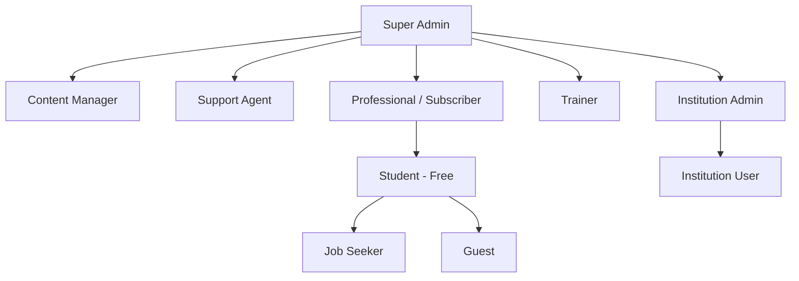

# User Roles & Permissions Matrix
**AI Learning & Member Management Platform — LearnFlow AI**
**Version:** 1.0 | **Date:** July 2026

---

## 1. Introduction

This document defines all user roles within LearnFlow AI, their access scope, permission levels across all platform entities, and the workflow for role assignment, promotion, and revocation. All role-based access control (RBAC) logic is enforced server-side via the API layer — the frontend merely reflects current permissions.

---

## 2. Role Definitions

### 2.1 Guest
A visitor who has not registered or logged in. Guests can browse the marketing pages and the public course catalog but cannot access any learning features.
- **Primary Goals:** Explore the platform, understand the value proposition, register
- **Key Actions:** Browse courses, view pricing, view marketing pages, click "Register"
- **Access Level:** Read-only on public endpoints only

### 2.2 Student (Free Learner)
A registered user on the Free plan. Can access up to 3 free courses, use the AI assistant with daily limits, and track basic progress.
- **Primary Goals:** Learn new skills, earn certificates, explore the platform
- **Key Actions:** Enroll in free courses, complete lessons, take quizzes, download basic certificate
- **Access Level:** Limited read + limited write on own learning data

### 2.3 Professional (Basic/Pro/Premium Subscriber)
A paying subscriber on any individual plan. Gets full platform access scaled to their subscription tier.
- **Primary Goals:** Upskill for career advancement, earn verifiable certificates, get AI guidance
- **Key Actions:** Enroll in any course, unlimited AI queries (Pro+), download lessons offline, share certificates
- **Access Level:** Full learner access + premium features per plan

### 2.4 Job Seeker
A registered user with the "Job Seeker" learning goal selected during onboarding. May receive subsidized or free access to specific job-readiness courses via partnerships.
- **Primary Goals:** Build job-ready skills fast, earn verifiable credentials
- **Key Actions:** Same as Student; may access curated Job Seeker course tracks
- **Access Level:** Same as Student, plus job-seeker-specific content feed

### 2.5 Trainer / Instructor
A verified content creator who publishes and manages courses on the platform. Must pass a trainer application review process.
- **Primary Goals:** Create high-quality courses, monetize expertise, track student performance
- **Key Actions:** Create courses, upload lessons, publish quizzes, view analytics, manage earnings
- **Access Level:** Full learner access + trainer-specific CREATE/EDIT/DELETE on own courses and lessons

### 2.6 Institution Admin
An administrator of an institutional (corporate/school) account. Manages team members, licenses, and progress reports within their organization.
- **Primary Goals:** Manage team learning, track completion, report to leadership
- **Key Actions:** Add/remove institution members, assign courses to groups, view progress reports, manage institutional billing
- **Access Level:** Full learner access + CRUD on institution members + view reports for their organization only

### 2.7 Institution User (Team Member)
A learner who belongs to an institutional account. Access is determined by the Institution Admin's assignments.
- **Primary Goals:** Complete assigned courses, comply with L&D requirements
- **Key Actions:** Learn assigned courses, take quizzes, earn certificates, report progress
- **Access Level:** Same as Professional (Pro plan) but access gated by Institution Admin assignments

### 2.8 Support Agent
A platform employee handling customer support tickets. Can view any user account for troubleshooting but cannot modify sensitive data without admin approval.
- **Primary Goals:** Resolve user issues quickly, improve satisfaction scores
- **Key Actions:** View user accounts, view/update tickets, send messages, escalate issues
- **Access Level:** Read on any user profile + CRUD on support tickets + limited write for issue resolution

### 2.9 Content Manager
A platform employee responsible for curating, reviewing, and managing course content and trainer submissions.
- **Primary Goals:** Ensure content quality, approve trainer submissions, manage catalog
- **Key Actions:** Review submitted courses, approve/reject/feature, edit metadata, manage categories
- **Access Level:** Full read on all courses + PUBLISH/UNPUBLISH/FEATURE powers + limited user read

### 2.10 Super Admin
The highest-privilege system user. Full access to all platform entities, settings, user data, billing, analytics, and system configuration.
- **Primary Goals:** Operate and govern the platform, ensure business performance
- **Key Actions:** All admin operations + system settings + user impersonation + financial reconciliation
- **Access Level:** CRUD on all entities, system settings, all analytics, all payment records

---

## 3. Role Hierarchy Diagram

---

## 4. Permissions Matrix

**Legend:** `✓` = Allowed | `✗` = Not allowed | `Own` = Own records only | `Org` = Within their institution only | `Admin` = Requires approval

### 4.1 Course Permissions
| Action | Guest | Student | Professional | Job Seeker | Trainer | Inst. Admin | Inst. User | Support | Content Mgr | Super Admin |
|---|---|---|---|---|---|---|---|---|---|---|
| Browse/Search Courses | ✓ | ✓ | ✓ | ✓ | ✓ | ✓ | ✓ | ✓ | ✓ | ✓ |
| View Course Detail | ✓ | ✓ | ✓ | ✓ | ✓ | ✓ | ✓ | ✓ | ✓ | ✓ |
| Enroll in Free Course | ✗ | ✓ (3 max) | ✓ | ✓ | ✓ | ✓ | ✓ | ✗ | ✗ | ✓ |
| Enroll in Paid Course | ✗ | ✗ | ✓ | ✗ | ✓ | ✓ (assigned) | ✓ (assigned) | ✗ | ✗ | ✓ |
| Create Course | ✗ | ✗ | ✗ | ✗ | Own | ✗ | ✗ | ✗ | ✗ | ✓ |
| Edit Course | ✗ | ✗ | ✗ | ✗ | Own | ✗ | ✗ | ✗ | ✓ (metadata) | ✓ |
| Delete Course | ✗ | ✗ | ✗ | ✗ | Own | ✗ | ✗ | ✗ | ✗ | ✓ |
| Publish/Unpublish Course | ✗ | ✗ | ✗ | ✗ | Own (submit) | ✗ | ✗ | ✗ | ✓ | ✓ |
| Feature Course on Homepage | ✗ | ✗ | ✗ | ✗ | ✗ | ✗ | ✗ | ✗ | ✓ | ✓ |
| Rate & Review Course | ✗ | ✓ | ✓ | ✓ | ✗ | ✗ | ✓ | ✗ | ✗ | ✓ |

### 4.2 Lesson Permissions
| Action | Guest | Student | Professional | Trainer | Inst. User | Support | Content Mgr | Super Admin |
|---|---|---|---|---|---|---|---|---|
| View Lesson (enrolled) | ✗ | ✓ | ✓ | ✓ | ✓ | ✗ | ✓ | ✓ |
| Download Lesson Offline | ✗ | ✗ | ✓ (Pro+) | ✓ | ✓ | ✗ | ✗ | ✓ |
| Create Lesson | ✗ | ✗ | ✗ | Own | ✗ | ✗ | ✗ | ✓ |
| Edit Lesson | ✗ | ✗ | ✗ | Own | ✗ | ✗ | ✓ (metadata) | ✓ |
| Delete Lesson | ✗ | ✗ | ✗ | Own | ✗ | ✗ | ✗ | ✓ |
| Reorder Lessons | ✗ | ✗ | ✗ | Own | ✗ | ✗ | ✗ | ✓ |
| Take Lesson Notes | ✗ | ✓ | ✓ | ✓ | ✓ | ✗ | ✗ | ✓ |

### 4.3 Certificate Permissions
| Action | Guest | Student | Professional | Trainer | Inst. Admin | Support | Super Admin |
|---|---|---|---|---|---|---|---|
| Generate Certificate | ✗ | ✓ (on completion) | ✓ | ✓ | ✗ | ✗ | ✓ |
| Download Certificate PDF | ✗ | Own | Own | Own | ✗ | ✗ | ✓ |
| Share to LinkedIn | ✗ | Own | Own | Own | ✗ | ✗ | ✓ |
| View Certificate Verification | ✓ | ✓ | ✓ | ✓ | ✓ | ✓ | ✓ |
| Revoke Certificate | ✗ | ✗ | ✗ | ✗ | ✗ | ✗ | ✓ |
| View All Certificates (Admin) | ✗ | ✗ | ✗ | ✗ | Org | ✗ | ✓ |

### 4.4 User Account Permissions
| Action | Student | Trainer | Inst. Admin | Support | Super Admin |
|---|---|---|---|---|---|
| View Own Profile | ✓ | ✓ | ✓ | Own | ✓ |
| Edit Own Profile | ✓ | ✓ | ✓ | ✗ | ✓ |
| View Any User Profile | ✗ | ✗ | Org only | ✓ (read-only) | ✓ |
| Create User Account | ✗ | ✗ | Org only | ✗ | ✓ |
| Edit Any User Account | ✗ | ✗ | Org only (limited) | ✗ | ✓ |
| Suspend User | ✗ | ✗ | Org only | Admin approval | ✓ |
| Delete User Account | ✗ | ✗ | ✗ | ✗ | ✓ |
| Impersonate User | ✗ | ✗ | ✗ | ✗ | ✓ (logged) |

### 4.5 Membership & Payment Permissions
| Action | Student | Professional | Inst. Admin | Support | Super Admin |
|---|---|---|---|---|---|
| View Own Membership | ✓ | ✓ | ✓ | ✓ (read) | ✓ |
| Subscribe to Plan | ✓ | ✓ | ✓ | ✗ | ✓ |
| Upgrade/Downgrade Plan | ✓ | ✓ | ✓ | ✗ | ✓ |
| Cancel Subscription | ✓ | ✓ | ✓ | Admin approval | ✓ |
| View Payment History | Own | Own | Org | Own | ✓ |
| Process Refund | ✗ | ✗ | ✗ | Admin approval | ✓ |
| Create Membership Plan | ✗ | ✗ | ✗ | ✗ | ✓ |
| Apply Coupon/Discount | Self | Self | Org | ✗ | ✓ |
| View All Payment Records | ✗ | ✗ | ✗ | ✗ | ✓ |
| Export Financial Data | ✗ | ✗ | Org | ✗ | ✓ |

### 4.6 Support Ticket Permissions
| Action | Learner | Trainer | Inst. Admin | Support Agent | Super Admin |
|---|---|---|---|---|---|
| Create Support Ticket | ✓ | ✓ | ✓ | ✗ | ✓ |
| View Own Tickets | ✓ | ✓ | ✓ | ✓ | ✓ |
| View All Tickets | ✗ | ✗ | Org only | ✓ | ✓ |
| Respond to Ticket | Own (reply) | Own (reply) | Own (reply) | ✓ | ✓ |
| Assign Ticket to Agent | ✗ | ✗ | ✗ | ✓ | ✓ |
| Resolve / Close Ticket | ✗ | ✗ | ✗ | ✓ | ✓ |
| View Ticket Analytics | ✗ | ✗ | Org | ✓ (own queue) | ✓ |

### 4.7 Analytics Permissions
| Action | Learner | Trainer | Inst. Admin | Content Mgr | Super Admin |
|---|---|---|---|---|---|
| View Own Progress Analytics | ✓ | ✓ | ✓ | ✗ | ✓ |
| View Course Analytics | ✗ | Own courses | Org only | ✓ | ✓ |
| View Revenue Analytics | ✗ | Own earnings | Org billing | ✗ | ✓ |
| View Platform-wide Analytics | ✗ | ✗ | ✗ | ✗ | ✓ |
| Export Analytics Data | Own data | Own course data | Org data | ✗ | ✓ |

---

## 5. Role Assignment Workflow

### 5.1 Default Role on Registration
All new users start as **Student (Free)** regardless of registration method.

### 5.2 Role Promotion Paths
| Promotion | Trigger | Process |
|---|---|---|
| Student → Professional | Purchase subscription | Automatic on payment confirmation |
| Student → Trainer | Submit trainer application | Manual review by Content Manager → Super Admin approves |
| User → Institution User | Institution Admin adds them | Invitation email sent, user accepts |
| User → Institution Admin | Super Admin designates | Manual assignment in Admin Panel |
| User → Support Agent | HR onboarding | Super Admin assigns role in system |
| User → Content Manager | HR onboarding | Super Admin assigns role in system |
| User → Super Admin | Founders/engineering team | Database-level role grant only |

### 5.3 Role Revocation
- **Subscription cancellation:** Professional → Student (at period end)
- **Trainer violation:** Content Manager or Super Admin demotes to Student, course content archived
- **Institution member removal:** Institution Admin removes user; role reverts to their personal plan
- **Support/Content Manager offboarding:** Super Admin revokes role; session invalidated immediately

---

## 6. Role-Specific Onboarding Paths

| Role | Onboarding Flow | Key Steps |
|---|---|---|
| Guest | Marketing-only | None required |
| Student | Learner onboarding | Goal selection → Interest tags → First course recommendation → Profile setup |
| Professional | Same as Student | + LinkedIn connection prompt + Career path selection |
| Job Seeker | Same as Student | + Skill gap assessment → Job-ready track recommendation |
| Trainer | Trainer onboarding | Application form → Identity verification → Course builder tutorial → First course creation |
| Institution Admin | Enterprise onboarding | Org profile setup → Seat provisioning → Member invitations → Admin dashboard tour |
| Support Agent | Internal onboarding | Admin assigns role → Support panel tutorial → SLA briefing |

---

## 7. Authentication Rules Per Role

| Role | Session Duration | MFA Required | Concurrent Sessions | Biometric Login |
|---|---|---|---|---|
| Guest | N/A | No | N/A | No |
| Student | 7 days (refresh) | Optional | Max 3 devices | Yes (mobile) |
| Professional | 7 days (refresh) | Optional | Max 5 devices | Yes (mobile) |
| Trainer | 7 days (refresh) | Recommended | Max 3 devices | Yes (mobile) |
| Institution Admin | 24h (refresh) | **Required** | Max 2 devices | No |
| Support Agent | 8h (work session) | **Required** | Max 1 device | No |
| Content Manager | 8h (work session) | **Required** | Max 1 device | No |
| Super Admin | 4h (short session) | **Required** | Max 1 device | No |

*All access and refresh token rotations are logged with IP, device fingerprint, and timestamp.*
